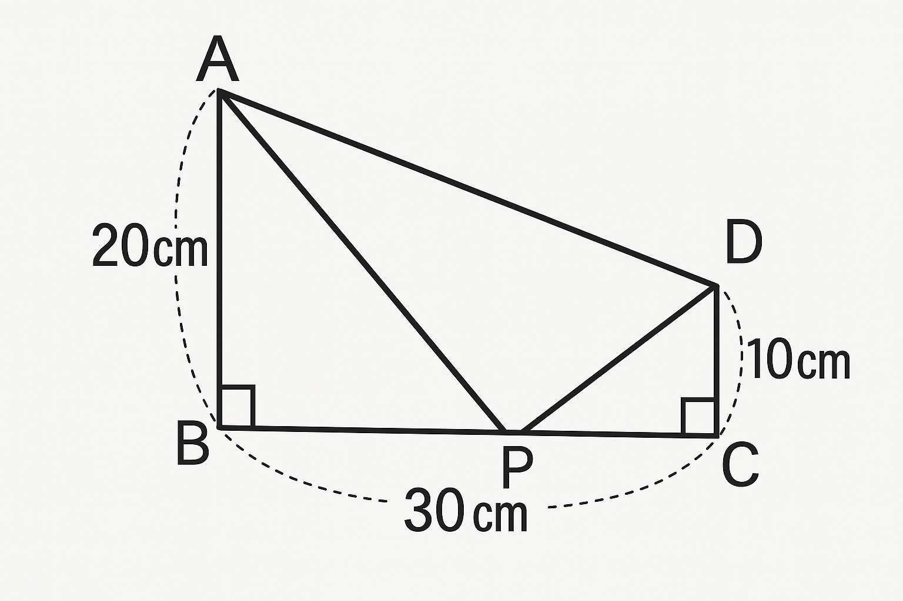

# 🧮 Advanced Problem 1 

"Try to solve it using only elementary school knowledge!"

In the figure shown, ABCD is a trapezoid.

AB=20cm
CD=10cm
BC=30cm

Point P is on line segment BC
The area of triangle APD is 210 cm²
What is the length of segment PC?

---

## 📝 Hint

## - Add the number of apples in each box.
## - Simple addition!

---

## 💬 Comments / Alternative Solutions

Feel free to share your ideas or ask questions.

---

## 🏷 Tags

- Elementary 
- Word Problem  
- Arithmetic (Addition)
