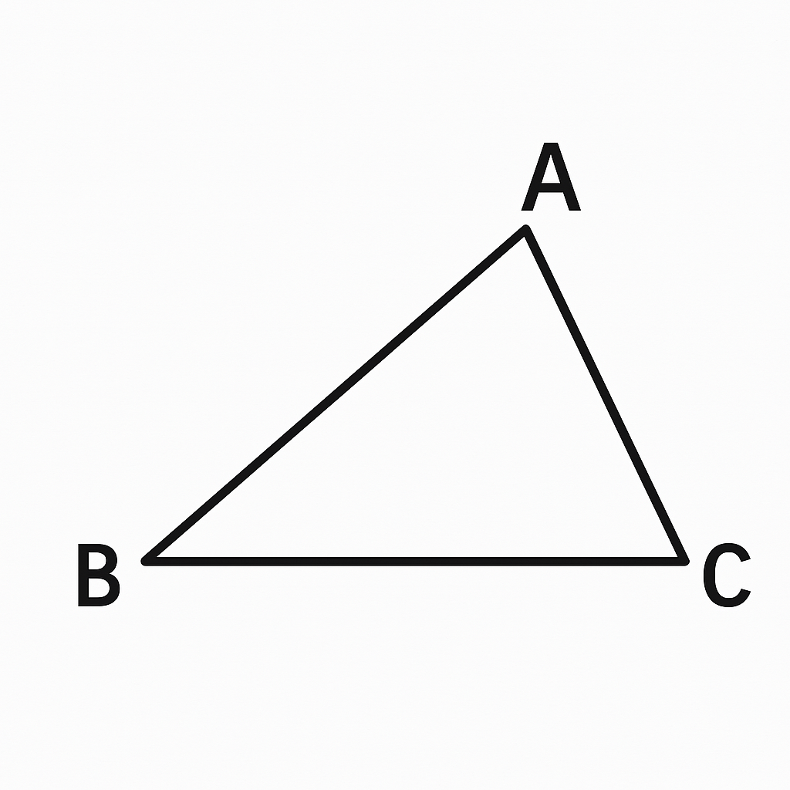

# 🧮 Advanced Problem 2

"Try to solve it using only elementary school knowledge!"

In triangle ABC, the following conditions are given:

The size of angle A is 9° greater than twice the size of angle B
The ratio of angle B to angle C is 4 : 7

Question:
What are the sizes (in degrees) of angles A, B, and C?

---

## 📝 Hint

## - Add the number of apples in each box.
## - Simple addition!

---

## 💬 Comments / Alternative Solutions

Feel free to share your ideas or ask questions.

---

## 🏷 Tags

- Elementary 
- Word Problem  
- Arithmetic (Addition)
